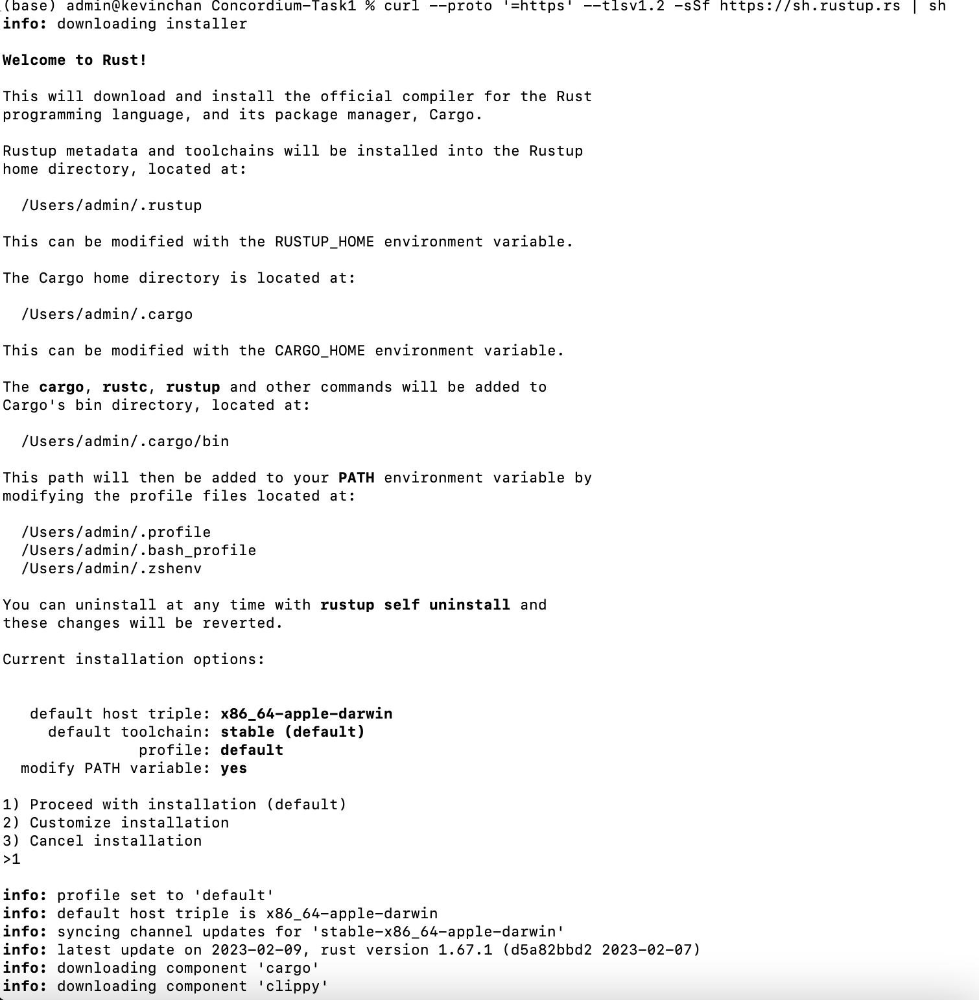
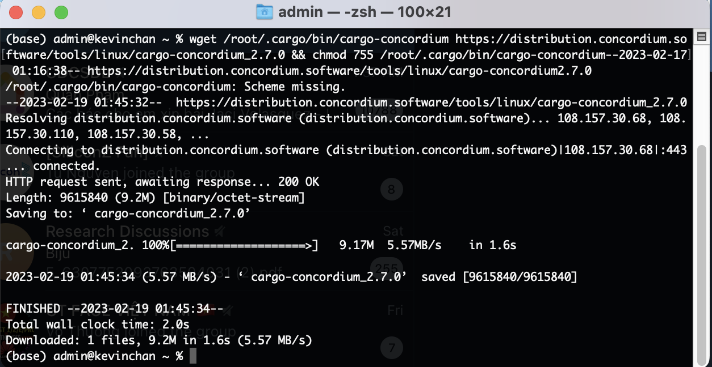
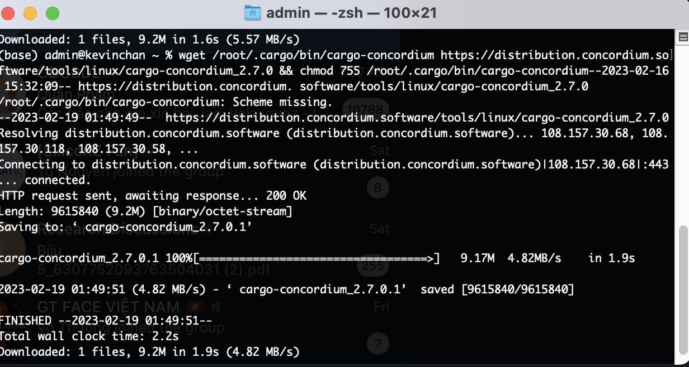
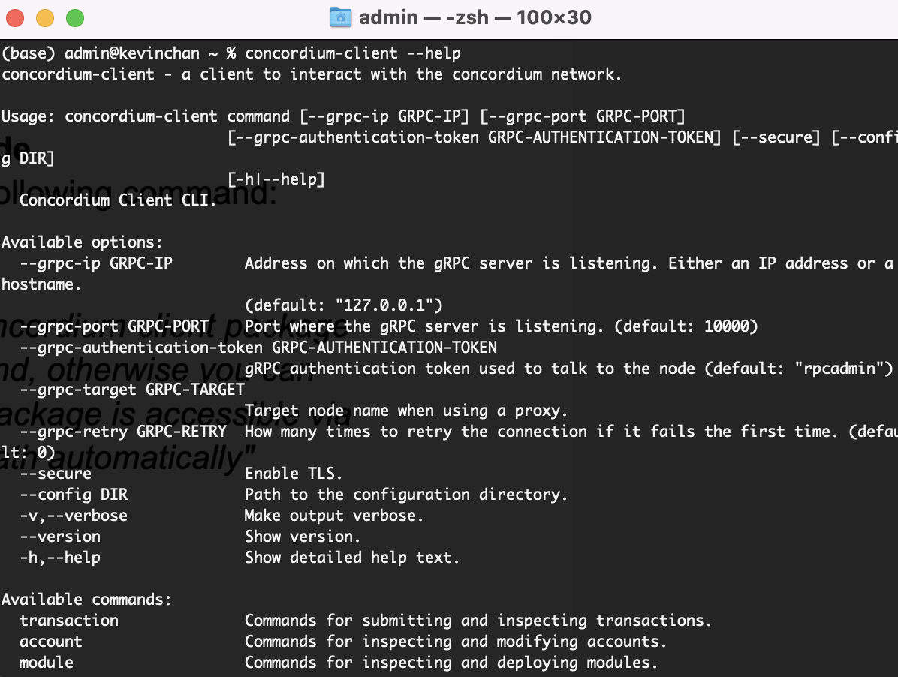
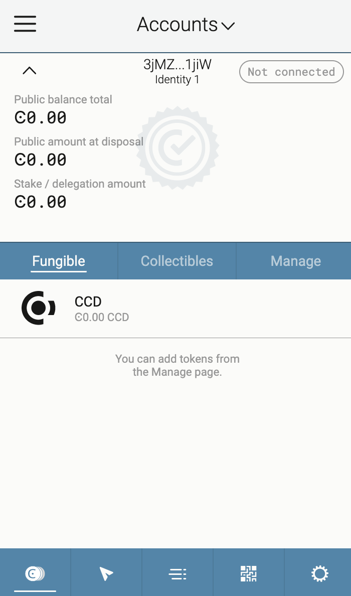
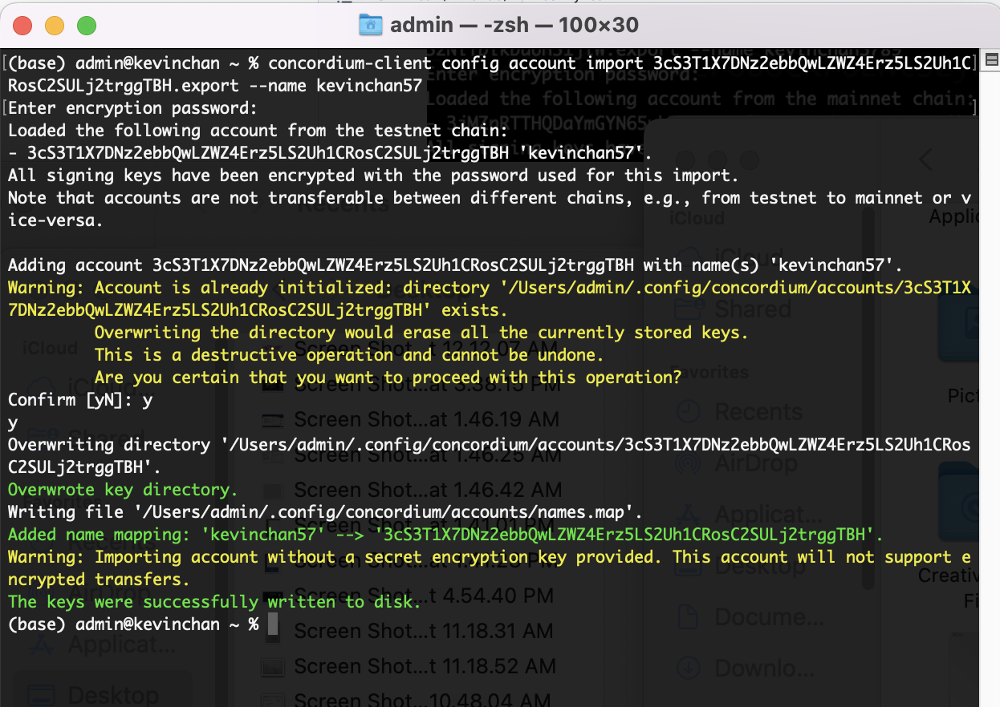

# Concordium Hackathon
## My mainnet address
3jMZnRTTHQDaYmGYN65uhTgJaZzTfiL7q5zNiTbikbdUH51jiW

## Task 1: Concordium Development Environment
### rust
Install rust: 

### cargo-concordium

### concordium-client

## testnet 
Create a Testnet account 

### export the account from web wallet and import it into Concordium client

