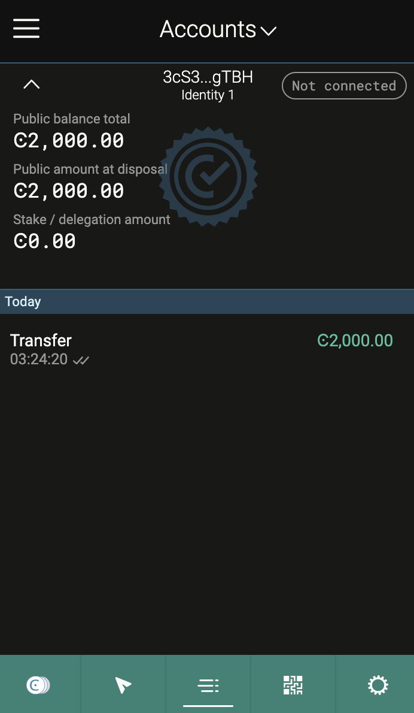

# Concordium Hackathon
## My mainnet address
32ySJo3LbUKXrjtzabHrTyukpeynjaWYhafwrtD6KJgHdx9Qgr

## Task 1: Concordium Development Environment
### rust
Install rust: 

### cargo-concordium

### concordium-client

## testnet 
Create a Testnet account 

### export the account from web wallet and import it into Concordium client
